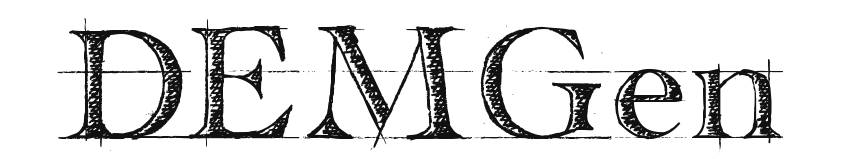

# DEMGen: Particle Packing Generator for Discrete Element Method (DEM)

![Release][release-image] 
![License][license-image]
![Contributing][contributing-image]

[release-image]: https://img.shields.io/badge/release-0.0.1-green.svg?style=flat 

[license-image]: https://img.shields.io/badge/license-BSD-green.svg?style=flat

[contributing-image]: https://img.shields.io/badge/Contributor%20Covenant-2.1-4baaaa.svg

For generating a particle packing with aim porosity.
