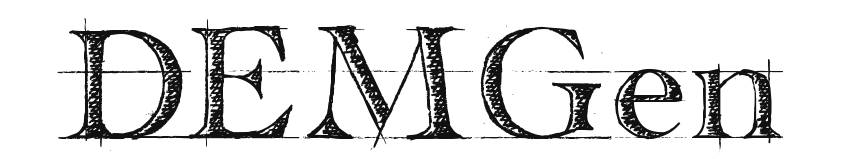

# DEMGen: Particle Packing Generator for Discrete Element Method

![Release][release-image] 
![License][license-image]
![Contributing][contributing-image]

[release-image]: https://img.shields.io/badge/release-0.0.1-green.svg?style=flat 

[license-image]: https://img.shields.io/badge/license-BSD-green.svg?style=flat

[contributing-image]: https://img.shields.io/badge/Contributor%20Covenant-2.1-4baaaa.svg

For generating a particle packing with aim porosity.

## Table of Contents
- [Main Features](#main-features)
- [Implementation Details](#implementation-details)
- [Instructions](#instructions)
    - [Input Files](#input-files)
    - [Running Simulations](#running-simulations)
    - [Plotting Results](#loading-results)
- [Examples](#examples)
- [Documentation](#documentation)
- [How to Contribute](#how-to-contribute)
- [How to Cite](#how-to-cite)
- [Authorship](#authorship)
- [License](#license)

## Main Features

This program deals with the classical **soft-sphere approach** of the DEM.
The main characteristics of this method are:

- It is assumed that the contact between the particles occurs through a small overlap between them.
- Each contact is evaluated through several time steps in an explicit integration scheme.
- Contact models relate the amount of overlap between neighboring particles to the forces between them.
- Other physical interactions (e.g. thermal) may also be related to the overlap between particles.
- The shape of the particles is kept unchanged during and after contacts. 

## Implementation Details

DEMLab is fully written in the [MATLAB][matlab_website] programming language, and adopts the Object Oriented Programming (OOP) paradigm to offer modularity and extensibility.

For large-scale problems, it is recommended to check the [DEM Application][demapp_link] of the [Kratos Multiphysics][kratos_link] framework.

## Instructions

### Input Files

There are three types of files that may be used as input for the program:

* **Parameters (_.json_)**: 

This [JSON][json_link] file is necessary for running a simulation and must always be accompanied by a _Model_ _Parts_ file.
The name of the _Model_ _Parts_ file must be indicated in the Input Group ["ProblemData"][problem_data_link] of this file.

It contains all the parameters and options for the analysis and outputs, as well as the conditions applied to the model.

A tutorial explaining each input field of this file can be found on its [Wiki page][wiki_parameters_link].
Moreover, a [template][parameters_link] of this file, with all the possible input options, is available.

* **Results (_.txt_)**: 

This binary file stores the results of a simulation.
It is generated only if requested in the Input Group ["Output"][output_link] of the _Project_ _Parameters_ file.

It can be loaded to show the results of previously run simulations, or used to restart a simulation from a saved stage.

### Running Simulations

To run a simulation, launch MATLAB and execute the script file [*main.m*][main_file_link] located inside the folder [*src*][src_folder_link].

### Loading Results

To load and show the results from previously run simulations, launch MATLAB and execute the script file [*main.m*][main_file_link] located inside the folder [*src*][src_folder_link].

A dialog box will pop up to select an appropriate _Results_ _Storage_ file.
Multiple _Results_ _Storage_ files can be selected to load and show results sequentially, as long as they are located in the same directory.

To restart a simulation from the stored results, place its _Results_ _Storage_ file in the same directory of the _Project_ _Parameters_ file and run the simulation.
The name of the _Results_ _Storage_ file must be the same of the simulation name indicated in the _Project_ _Parameters_ file.

## Examples

Sample models are available inside the folder [*examples*][examples_link].

They are separated into different sub-folders according to their analysis type,
and each example has its _Project_ _Parameters_ and _Model_ _Parts_ files, as well as some results in the output sub-folders.

## Documentation

## How to Contribute

Please check the [contribution guidelines][contribute_link].

## How to Cite

To cite this repository, you can use the metadata from [this file][citation_link].

## Authorship

- **Chengshun Shang** (<cshang@cimne.upc.edu>)

International Center for Numerical Methods in Engineering ([CIMNE][cimne_website]) 
and
Polytechnic University of Catalonia ([UPC BarcelonaTech][upc_website])

&nbsp;&nbsp;&nbsp;&nbsp;&nbsp;&nbsp;&nbsp;&nbsp;

&nbsp;&nbsp;&nbsp;&nbsp;&nbsp;&nbsp;&nbsp;&nbsp;
 

## License

DEMLab is licensed under the [BSD license][bsd_license_link],
which allows the program to be freely used by anyone for modification, private use, commercial use, and distribution, only requiring the preservation of copyright and license notices.
No liability and warranty are provided.

[demapp_link]:          https://github.com/KratosMultiphysics/Kratos/tree/master/applications/DEMApplication
[kratos_link]:          https://github.com/KratosMultiphysics/Kratos
[json_link]:            https://www.json.org/
[contribute_link]:      https://github.com/ChengshunShang1996/DEMGen/blob/main/CONTRIBUTING.md
[citation_link]:        https://github.com/ChengshunShang1996/DEMGen/blob/main/CITATION.cff
[cimne_website]:        https://www.cimne.com/
[upc_website]:          https://camins.upc.edu/
[bsd_license_link]:     https://choosealicense.com/licenses/bsd-2-clause/