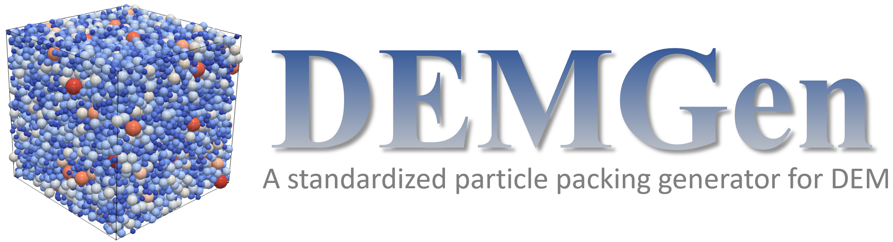
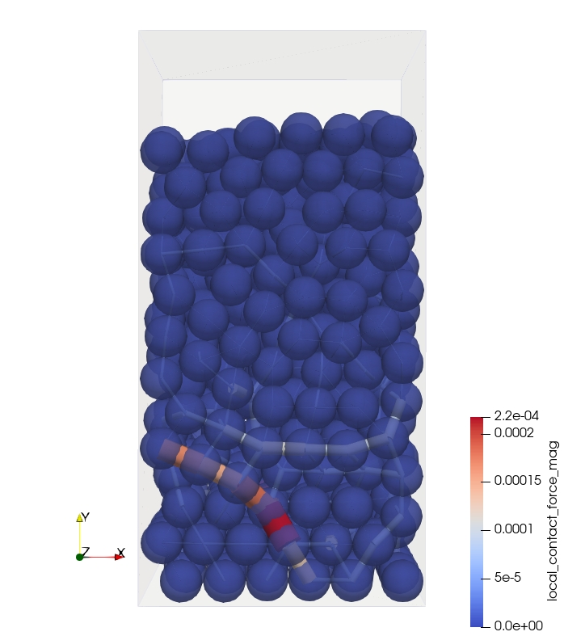

# DEMGen: A Standardized Particle Packing Generator for the Discrete Element Method

![Release][release-image] 
![License][license-image]
![Contributing][contributing-image]

[release-image]: https://img.shields.io/badge/release-1.1.0-green.svg?style=flat 

[license-image]: https://img.shields.io/badge/license-BSD-green.svg?style=flat

[contributing-image]: https://img.shields.io/badge/Contributor%20Covenant-2.1-4baaaa.svg

This code aims to achieve a standardized particle packing generation framework for granular materials. This code not only allows users to generate a series of random packings that fulfill their requirements (such as particle size distribution, porosity, and stress) but also provides a series of tools for particle packing characterization of internally or externally generated packings.

## Table of Contents
- [Main Features](#main-features)
- [DEMGen Dependencies](#demgen-dependencies)
- [Instructions](#instructions)
    - [Input and Output Files](#input-and-output-files)
    - [Running Simulations](#running-simulations)
        - [Packing Generation](#packing-generation)
        - [Packing Characterization](#packing-characterization)
    - [Checking Results](#checking-results)
- [Examples](#examples)
- [Documentation](#documentation)
- [How to Contribute](#how-to-contribute)
- [How to Cite](#how-to-cite)
- [Authorship](#authorship)
- [License](#license)

## Main Features

This program can be used for DEM particle packing generation. From this point of view, it can be treated as a pre-processing tool for any 3D DEM code. Meanwhile, it can be used for quantitative packing characterization, allowing users to have a deep insight into the material properties from the view of geometry components. The main characteristics of this framework are:

- It provides a standardized framework for particle packing generation.
- Both dynamic methods and constructive methods are available for particle packing generation (The constructive method is limited to regular arrangement up to now).
- Providing a method (radius expansion method with servo control) for achieving both packing density and initial stress.
- The periodic boundary is available for boundary conditions, allowing users to clone a small RVE packing to a large one.
- Providing a series of tools for packing characterization.

## DEMGen Dependencies

DEMGen is fully written in the [Python][python_website] programming language and adopts the Object Oriented Programming (OOP) paradigm to offer modularity and extensibility. Due to the nature of Python, this program can be run on different platforms (Windows or Linux)

Please make sure you have installed Python3.X.X on your PC. Currently, [Python3.10.X][python310_website] is recommended, as other versions haven't been tested.

Required Python Pakage:
- numpy
- matplotlib
- pyevtk

Environment variable setting in a Command Prompt:

> set PYTHONPATH=%PYTHONPATH%;'path_to_DEMGen'

For the dynamic generation methods, DEM calculations are required. The [DEM Application][demapp_link] of the [Kratos Multiphysics][kratos_link] framework is adopted here. A compiled Kratos for Windows environment (Python 3.10.11 and Visual Studio 2022) has been attached in the source code "./src/external/kratos". For using Kratos, the following environment variable need to be set in a Command Prompt:

> set PYTHONPATH=%PYTHONPATH%;'path_to_DEMGen'/src/external/kratos \
> set PATH=%PATH%;'path_to_DEMGen'/src/external/kratos/libs

Tip: This compiled Kratos may not work properly due to the different system environment setting. So it is recommanded to compile your own Kratos according to the Kratos [INSTALL.md][kratos_install_link].

## Instructions

### Input and Output Files

* **Input Parameters (_.json_)**: 

This [JSON][json_link] file is used as input for the program. For generating particle packings, at least one input file is needed: [ParametersDEMGen.json][ParametersDEMGen_link]. For dynamic generation methods, both [MaterialsDEM.json][MaterialsDEM_link] and [ProjectParametersDEM.json][ProjectParametersDEM_link] are needed as the Kratos DEM simulation will be run.

* **Output Results (_.mdpa_)**: 

This [MDPA][mdpa_link] file is used for storing the particle information of a packing. Usually, you can find the generated packing in the folder "./generated_cases/cases_$number$/show_packing/" (for dynamic methods) or "./show_packing/" (for constructive methods) of the working path. To visualize the results, ".vtu" format is used for [Paraview][paraview_link] and ".res" format is used for [GiD][gid_link].

### Running Simulations

To run a simulation, launch the [DEMGen_framework_main.py][DEMGen_framework_main] inside the folder [./src][src_folder]. For running the file correctly, please modify the "aim_path" (at the last of the file) to your own case path (absolute one).

#### Packing Generation

For running the particle packing generation process using different generation methods, different parameters need to be set in the [ParametersDEMGen.json][ParametersDEMGen_link]. Please study the [example case][examples_link] of different methods for futher usage.

#### Packing Characterization

If the related parameters in [ParametersDEMGen.json][ParametersDEMGen_link] are 'activated', the partcile packing characterization process will be run automatically. Those parameters are:

> "packing_charcterization_option" : true/flase,\
> "regular_shape_option"           : true/flase,\
> "packing_charcterization_setting": \
> {\
>   "RVE_lambda_initial"                      : 1,\
>   "RVE_lambda_increment"                    : 1,\
>   "measure_density_option"                  : true/flase,\
>   "measure_mean_coordination_number_option" : true/flase,\
>   "measure_anisotropy_option"               : true/flase \
> }

### Checking Results

In the case folder or in the generated case folder, there will be a folder call "show packing", there you can find the post-processing file of the generated packing. Then it can be checked in Paraview or Gid.

## Examples

Examples are available inside the folder [examples][examples_link].

### Dynamic methods

- [test_gravitational_deposition_method][test_gravitational_deposition_method_link]
- [test_isotropic_compression_method][test_isotropic_compression_method_link]
- [test_radius_expansion_method][test_radius_expansion_method_link]
- [test_radius_expansion_with_servo_control_method][test_radius_expansion_with_servo_control_method_link]
- [test_improved_radius_expansion_with_servo_control_method][test_improved_radius_expansion_with_servo_control_method_link]. This is the Improved Radius Expansion method with Servo control and Random shifting (IRESR) used in the paper (under review now). **Important tip**: To run this method properly, you need to use the branch named "fix-stress-calculation" of Kratos DEM until the development in this branch is merged to the "master".

### Constructive methods

- [test_cubic_arrangement_method][test_cubic_arrangement_method_link]
- [test_hpc_arrangement_method][test_hpc_arrangement_method_link]

### Example cases

#### Case 1: Some results from example [test_improved_radius_expansion_with_servo_control_method][test_improved_radius_expansion_with_servo_control_method_link].

Three random generated particle packings according to the PSD of weak sandstone.

Here is [an example PDF file][an_example_PDF_link] for packing characterization.

#### Case 2: Some results from example [test_gravitational_deposition_method][test_gravitational_deposition_method_link].

Packing generated with rigid walls as boundary conditions.

&nbsp;&nbsp;&nbsp;&nbsp;&nbsp;&nbsp;&nbsp;&nbsp;

&nbsp;&nbsp;&nbsp;&nbsp;&nbsp;&nbsp;&nbsp;&nbsp;
 

The final packing.

&nbsp;&nbsp;&nbsp;&nbsp;&nbsp;&nbsp;&nbsp;&nbsp;

Packing generated with periodic boundaries.

&nbsp;&nbsp;&nbsp;&nbsp;&nbsp;&nbsp;&nbsp;&nbsp;

&nbsp;&nbsp;&nbsp;&nbsp;&nbsp;&nbsp;&nbsp;&nbsp;
 

The final packing.

&nbsp;&nbsp;&nbsp;&nbsp;&nbsp;&nbsp;&nbsp;&nbsp;

By comparing the results of the two conditions, we could find that using periodic boundaries can help us get a particle packing with more homogeneous force chains.

&nbsp;&nbsp;&nbsp;&nbsp;&nbsp;&nbsp;&nbsp;&nbsp;

&nbsp;&nbsp;&nbsp;&nbsp;&nbsp;&nbsp;&nbsp;&nbsp;
 

#### Case 3: Some results from example [test_cubic_arrangement_method][test_cubic_arrangement_method_link] (left) and [test_hpc_arrangement_method][test_hpc_arrangement_method_link] (right). 

&nbsp;&nbsp;&nbsp;&nbsp;&nbsp;&nbsp;&nbsp;&nbsp;

&nbsp;&nbsp;&nbsp;&nbsp;&nbsp;&nbsp;&nbsp;&nbsp;
 

#### Case 4: Ongoing work

Generating particle packings with complex shapes using a Clone and Extraction method.

&nbsp;&nbsp;&nbsp;&nbsp;&nbsp;&nbsp;&nbsp;&nbsp;

## Documentation

Please read this README.md for information.

## How to Contribute

Please check the [contribution guidelines][contribute_link].

## How to Cite

To cite this repository, you can use the metadata from [this file][citation_link].

## Authorship

- **Chengshun Shang** 1,2 (<cshang@cimne.upc.edu>)

1 International Center for Numerical Methods in Engineering ([CIMNE][cimne_website])

2 Universitat Politècnica de Catalunya ([UPC][upc_website])

&nbsp;&nbsp;&nbsp;&nbsp;&nbsp;&nbsp;&nbsp;&nbsp;

&nbsp;&nbsp;&nbsp;&nbsp;&nbsp;&nbsp;&nbsp;&nbsp;
 

## License

DEMGen is licensed under the [BSD license][bsd_license_link],
which allows the program to be freely used by anyone for modification, private use, commercial use, and distribution, only requiring the preservation of copyright and license notices.
No liability and warranty are provided.

[demapp_link]:          https://github.com/KratosMultiphysics/Kratos/tree/master/applications/DEMApplication
[kratos_link]:          https://github.com/KratosMultiphysics/Kratos
[kratos_install_link]:  https://github.com/KratosMultiphysics/Kratos/blob/master/INSTALL.md
[json_link]:            https://www.json.org/
[contribute_link]:      https://github.com/ChengshunShang1996/DEMGen/blob/main/CONTRIBUTING.md
[citation_link]:        https://github.com/ChengshunShang1996/DEMGen/blob/main/CITATION.cff
[cimne_website]:        https://www.cimne.com/
[upc_website]:          https://camins.upc.edu/
[bsd_license_link]:     https://choosealicense.com/licenses/bsd-2-clause/
[python_website]:       https://www.python.org/
[python310_website]:    https://www.python.org/downloads/release/python-3100/
[examples_link]:        ./example/
[DEMGen_framework_main]: ./src/DEMGen_framework_main.py
[src_folder]:           .src/ 
[ParametersDEMGen_link]: ./example/test_gravitational_deposition_method/ParametersDEMGen.json
[MaterialsDEM_link]:    ./example/test_gravitational_deposition_method/MaterialsDEM.json
[ProjectParametersDEM_link]: ./example/test_gravitational_deposition_method/ProjectParametersDEM.json
[mdpa_link]:            https://github.com/KratosMultiphysics/Kratos/wiki/Input-data
[paraview_link]:        https://www.paraview.org/         
[gid_link]:             https://www.gidsimulation.com/

[test_gravitational_deposition_method_link]: ./example/test_gravitational_deposition_method
[test_isotropic_compression_method_link]:    ./example/test_isotropic_compression_method
[test_radius_expansion_method_link]:         ./example/test_radius_expansion_method
[test_radius_expansion_with_servo_control_method_link]: ./example/test_radius_expansion_with_servo_control_method
[test_improved_radius_expansion_with_servo_control_method_link]: ./example/test_improved_radius_expansion_with_servo_control_method
[test_cubic_arrangement_method_link]:        ./example/test_cubic_arrangement_method
[test_hpc_arrangement_method_link]:          ./example/test_hpc_arrangement_method
[an_example_PDF_link]:                       ./docs/example_of_packing_characterization/all_measured_results.pdf